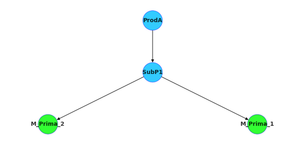

# PPS-Robotica-Audisio-CIM_Manager
Desarrollo de un software que cumpla la funcion de manager del CIM.
En la carpeta "Pruebas" se encuentra la última version del codigo de python, junto a los archivos csv correspondientes.

Actualmente hay 3 productos para producir, contenidos en 3 grafos:

